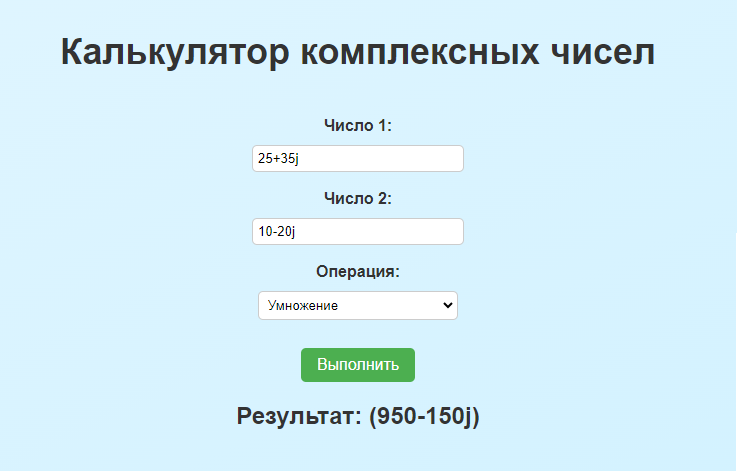

# Калькулятор комплексных чисел

Простое веб-приложение калькулятора комплексных чисел с использованием Flask.

## Установка

1. Установите Python (версия 3.x) с официального сайта [python.org](https://www.python.org).

2. Установите зависимости, выполнив следующую команду:
pip install flask loguru
## Запуск

1. Перейдите в каталог проекта:
cd calculator_project

2. Запустите приложение:
python main.py

3. Откройте веб-браузер и перейдите по адресу [http://localhost:5000](http://localhost:5000).

## Логирование

Приложение калькулятора комплексных чисел теперь поддерживает логирование с использованием библиотеки Loguru. Логи записываются в файл `calculator.log`, который находится в папке `logs`. Вы можете настроить поведение логирования, например, размер файла журнала или максимальное количество файлов, используя методы из модуля Loguru.

## Лицензия

Этот проект лицензирован под лицензией MIT. Подробности см. в файле [LICENSE](LICENSE).

